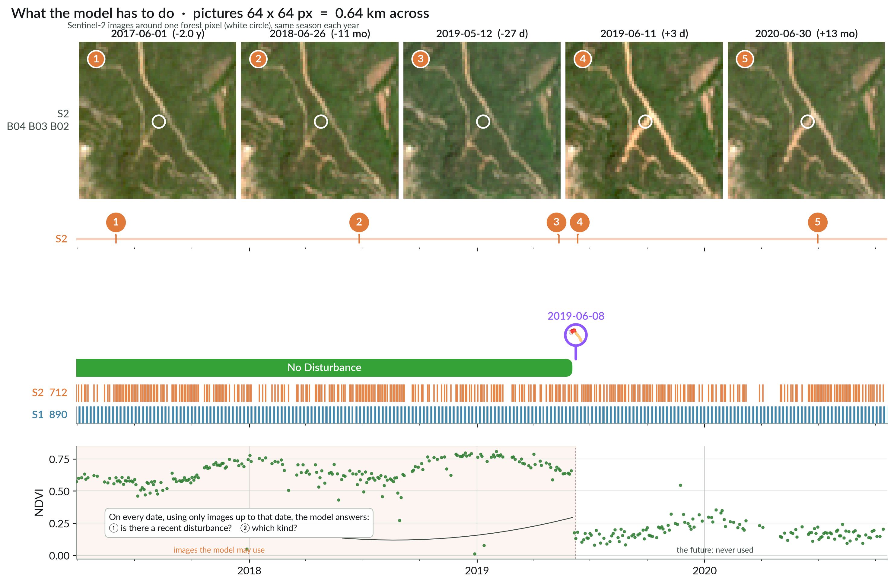

# 🌲 The problem

[Docs home](README.md) · next: [The data →](02_dataset.md)

Forests cover 40 % of the EU, and they are changing fast. Storms, bark beetles, fires and
harvesting all remove trees, and forest services need to know **where, when and why** —
fast enough to act.

| What happened | Why the answer must come quickly |
|---|---|
| Wind | organise the clean-up before the insects arrive |
| Bark beetle | remove infested trees before the outbreak spreads |
| Wildfire | map the burnt area, plan restoration |
| Clear cut, thinning | check the permits, update carbon accounts |

Nobody can walk every hectare. Satellites can: **Sentinel-2** photographs all of Europe
every ~5 days, **Sentinel-1** radar sees through clouds. Both are free. Alert systems
already exist (RADD, OPERA DIST-ALERT, the EU Forest Disturbance Atlas), but they mostly
answer "did something change?" — not what changed, and not fast enough.

## 🎯 What you have to do

For each satellite image of a location, using **only that image and the ones before it**,
predict:

1. is there a recent disturbance?
2. which kind — clear cut, thinning, salvage, wildfire, wind, insects?

That is what a forest service would act on. "Recent" matters: "disturbed" is not a state,
it fades as the forest regrows.

## ⚠️ Why it is hard

- Clouds. Half the Sentinel-2 images of a spot are useless, and you cannot choose when.
- Seasons. A beech forest in winter looks "disturbed" every single year.
- Speed vs noise. One suspicious image is not an alert; waiting for certainty is too late.
- Look-alikes. A clear cut, a storm and a salvage cut all end with bare ground.
- Rare classes. The whole dataset holds 18 distinct fires.

## 📖 Read more

A few reads to get started with near real-time (NRT) forest disturbance detection and
attribution. None is required; skim what catches your eye.

### Why this project

**[Forest practitioners' requirements for remote sensing-based disturbance products](https://academic.oup.com/forestry/article/98/2/233/7676651)**
— what forest practitioners would ideally need from remote sensing and machine learning,
and what exists today. Where this project comes from, and why the metrics look the way
they do.

### Our data

**[DISFOR](https://essd.copernicus.org/preprints/essd-2026-185)** — the annotations of our
benchmark and how they were made. Our dataset differs slightly: we removed some anomalous
time series, downloaded larger Sentinel-2 patches and Sentinel-1 patches, and remapped the
labels to a smaller set of classes we care about.

### Forest change maps: yearly, not NRT

| | |
|---|---|
| **[Hansen et al., Global Forest Change](https://www.science.org/doi/10.1126/science.1244693)** | The seminal paper on mapping forests and their change through time. Detection only, no attribution, yearly. The maps are updated every year and widely used downstream. |
| **[EFDA](https://essd.copernicus.org/articles/17/2373/2025/essd-17-2373-2025.html)** | A European forest disturbance map: yearly maps, attributed to 3 classes that partly match ours. A good picture of disturbances in Europe. |

### NRT systems deployed today

| | |
|---|---|
| **[Global Forest Watch](https://globalnaturewatch.org)** | World Resources Institute platform that gathers NRT disturbance alerts from several sources. The entry point to what is actually deployed at scale. |
| **[RADD](https://iopscience.iop.org/article/10.1088/1748-9326/abd0a8)** | Sentinel-1 (radar) alerts, for places where clouds leave too few optical images (Sentinel-2, Landsat). Designed for tropical rainforests. |
| **[RADD-Europe](https://www.sciencedirect.com/science/article/pii/S0034425726000957)** | A slight adaptation of RADD to Europe. |
| **[OPERA DIST-ALERT / DIST-HLS](https://www.nature.com/articles/s41467-025-64014-9)** | NASA's latest deployed change detection, on Harmonized Landsat Sentinel-2 (HLS) optical data. |
| **[OPERA DIST-S1](https://opera-cal-val.github.io/opera-blog/dist-s1)** | The same family, on Sentinel-1. |
| **[FORDEAD](https://www.theia-land.fr/en/blog/product/fordead-a-python-package-for-vegetation-anomalies-detection-from-sentinel-2-images)** | A Sentinel-2 anomaly detector that works quite well on our dataset. |

### Another benchmark

**[JRC near real-time forest disturbance monitoring challenge](https://forest.jrc.ec.europa.eu/en/activities/jrc-near-real-time-forest-disturbance-monitoring-challenge)**
— a recent NRT benchmark, a bit like ours. Only a curiosity: if you want, train on our data
and see how your model does on theirs. Check first which inputs and outputs it allows.

[Docs home](README.md) · next: [The data →](02_dataset.md)
