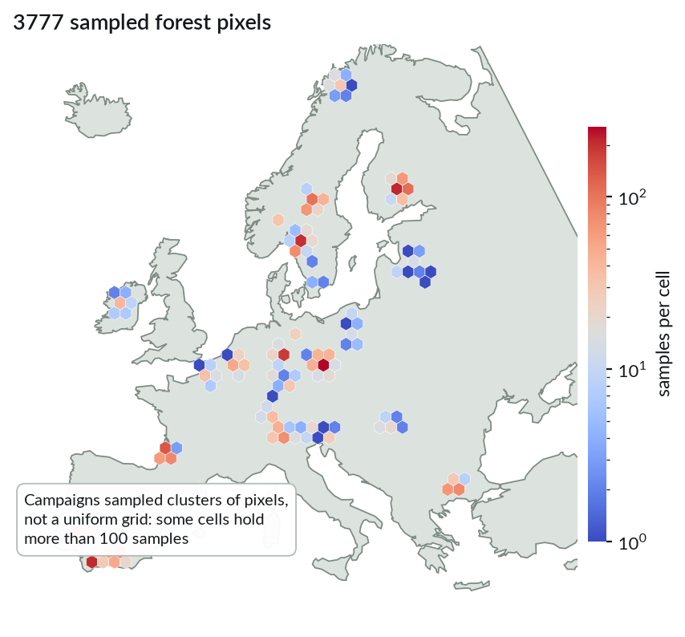
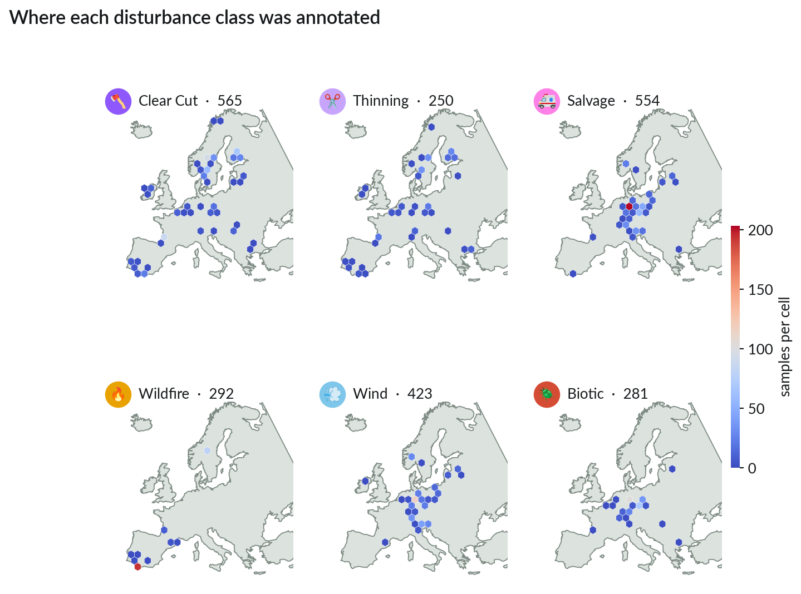
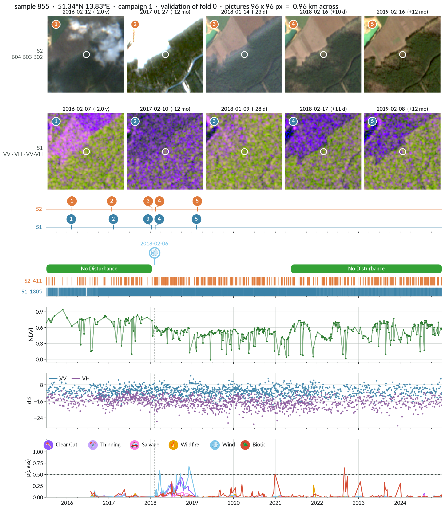
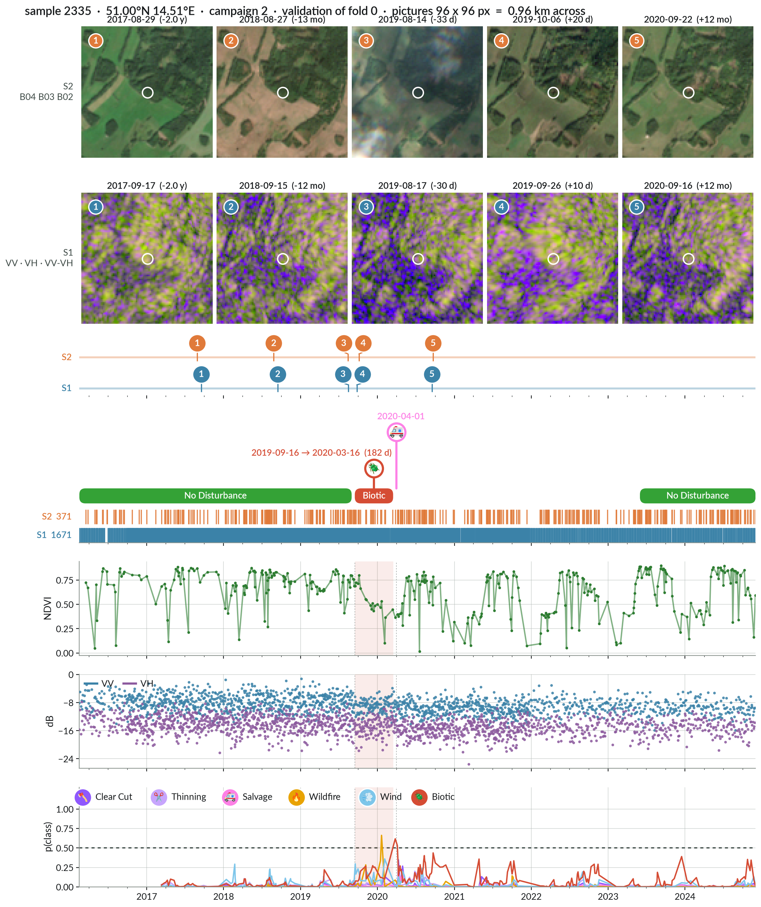
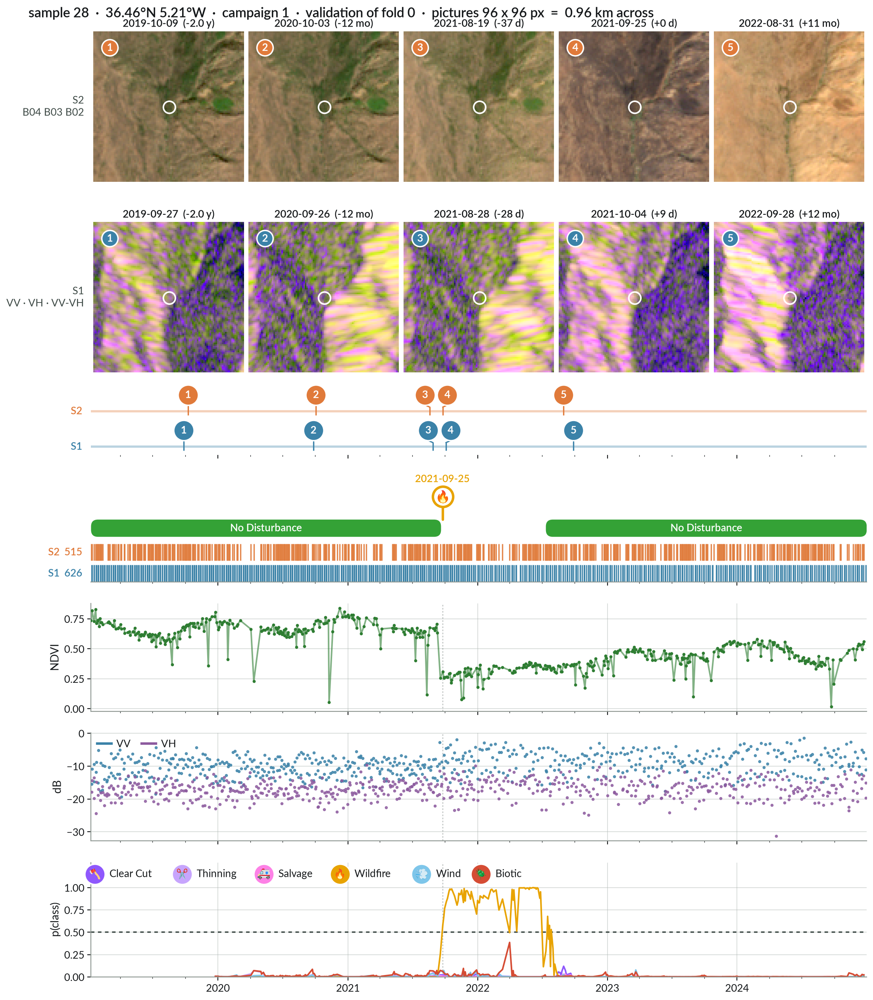
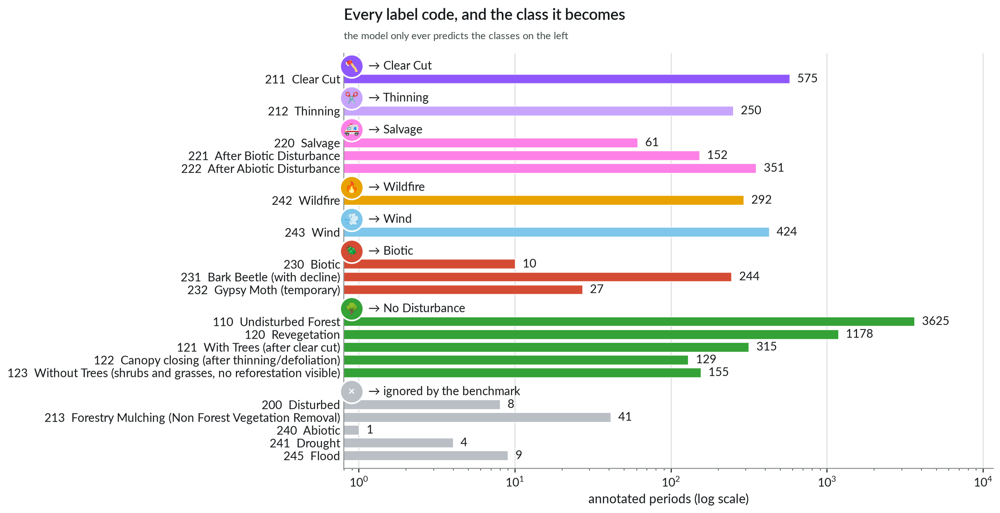
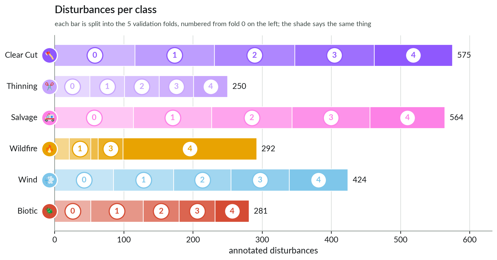
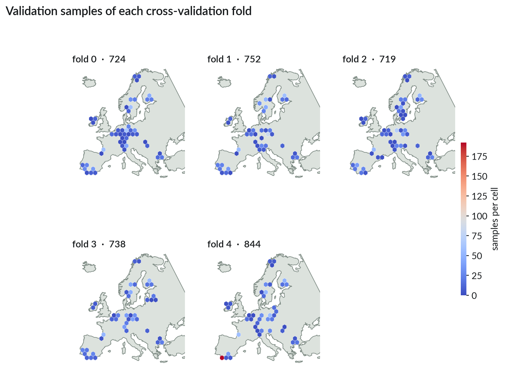

# 💾 The data

[← The problem](01_project.md) · [Docs home](README.md) · next: [Data to predictions →](03_baseline_model.md)

| | |
|---|---|
| **3777 locations** in Europe | one sample = one 10 m × 10 m pixel followed over time |
| **7851 annotated periods** | experts read each time series and cut it into periods |
| **July 2015 → January 2025** | median 356 usable Sentinel-2 and 1003 Sentinel-1 images per sample |
| **252 × 252 pixel patches** | 2.5 km of Sentinel-1 + Sentinel-2 around each location, 1.7 TB |
| **5 folds** | fold 0 for exploring, all five for a result |



Three labelling campaigns built it: one aimed at fire, wind and bark beetle (868 samples),
one at forest management and undisturbed forest (2615), one at windthrow after 12 mapped
storms (294). So do not treat this as a random sample of Europe — fires are wildly
over-represented, and they come from only 18 distinct fires.

**The dates are approximate, and that is part of the problem.** An expert can only see a
change on a cloud-free image, so the real event happened somewhere before the date they
wrote down — and people reading thousands of time series also make mistakes. Your model
may flag a disturbance before its annotated date and still be right. That is why the
metrics score a window rather than a single day.



## 📍 One sample, one story



`labels.parquet` holds one row per period. For the sample above:

| period | label | start | end_evidence | is_event |
|---|---|---|---|---|
| 0 | 110 Undisturbed Forest | 2015-07-04 | 2018-01-14 | False |
| 1 | 243 Wind | 2018-02-06 | 2018-02-06 | True |
| 2 | 121 With Trees (after clear cut) | 2021-05-18 | 2024-12-31 | False |

- **start** is the first *clear* image on which the expert saw the change. The real event
  happened somewhere between the previous clear image and that one.
- **end_evidence** is the last image showing evidence of that label; for sudden events it
  is usually the same day.
- **`is_event` is not the disturbance flag.** All 281 bark beetle and moth annotations have
  `is_event = False`: they are *periods*, median 458 days long, not dates. Treating them as
  dates is wrong in the figures and in your code. Always go through the label mapping.
- **The figures show the class the benchmark uses, not the raw code.** "Undisturbed Forest"
  and "Revegetation" both appear as *No Disturbance*; ignored codes are not drawn at all.

A bark beetle outbreak is the other shape a disturbance can take — a stretch of time, here
182 days, with salvage logging after it:



A fire, on the other hand, is unmistakable — and the baseline catches it:



## 🎯 The classes you predict



Six disturbance classes plus "No Disturbance": Clear Cut, Thinning, Salvage, Wildfire,
Wind, Biotic. Raw label codes map to them in
[`configs/label_mapping.yaml`](../configs/label_mapping.yaml) — four rare or vague codes
(drought, flood, "disturbed", "abiotic") are ignored there, and you can change the mapping,
for example to a binary task. About half the samples (1913) are never disturbed.



## 🗂️ What is on disk

```
$DISFOR_DATA_ROOT/
├── samples.parquet          3777 rows   location, campaign, confidence
├── labels.parquet           7851 rows   the annotated periods
├── splits.parquet          18885 rows   sample_id, fold_id (0-4), split
├── zarr_frames.parquet      5.5 M rows  every usable image: sample_id, sensor, date, zarr_id
├── center_pixels.parquet    5.5 M rows  the labelled pixel of every image (56 MB) ← the baseline reads this
└── patches/{sample_id}.zarr 1.7 TB      s2_10m, s2_20m, s2_60m, s2_scl (cloud mask), s1
```

Three things that will bite you:

- **The labelled pixel is `[126, 126]`** in the 10 m arrays — `[63, 63]` at 20 m, `[21, 21]` at 60 m.
- **The zarr time axis is not sorted by date.** Go through `zarr_frames.parquet`, or the
  `dates` attribute of `s2_scl` / `s1`; `zarr_id` is the position on that axis. Sentinel-1
  and Sentinel-2 have separate axes.
- **Scaling.** Sentinel-2: reflectance = (value − 1000) / 10000, and 0 means no data
  (the baseline does not mask it — that is a free improvement for you). Sentinel-1: dB = value / 100.
  The config does the scaling for you.

Images where more than half the patch was cloudy are already gone. The rest can still be
cloudy *at your pixel*: that is what the spikes in the NDVI curves are.

## 🔀 Folds, and how to report a result



Samples that overlap, or belong to the same storm or the same fire, are kept in the same
fold — otherwise you would test on pixels you trained on. Fold 4 carries one Spanish fire
annotated 193 times, which is why it looks odd.

- **Explore on fold 0.**
- **For a reported result: train all five folds, concatenate the five validation prediction
  files, compute the metrics once.** Never average five per-fold scores: the folds share
  80 % of their training data, and fold 4 is a different population.

[← The problem](01_project.md) · [Docs home](README.md) · next: [Data to predictions →](03_baseline_model.md)
