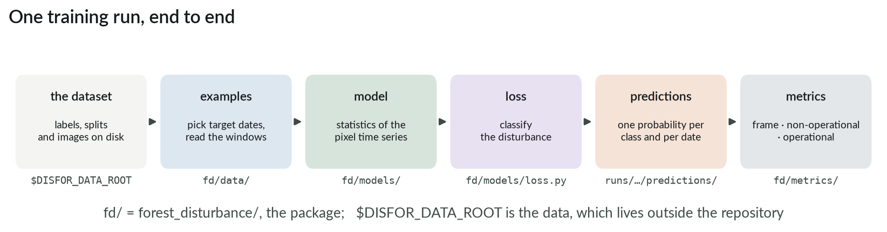
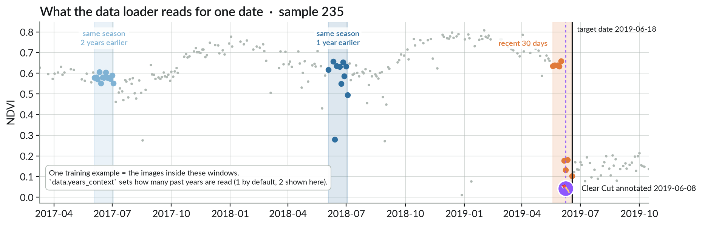
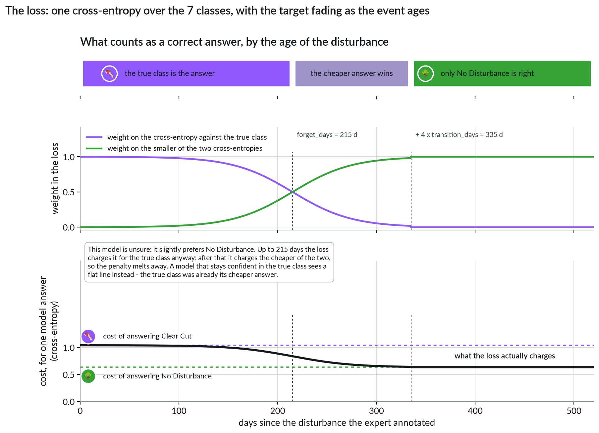
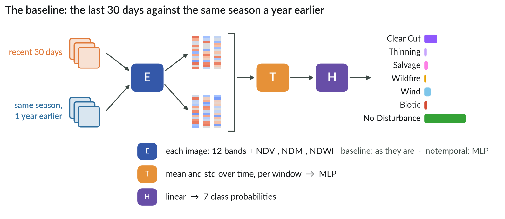
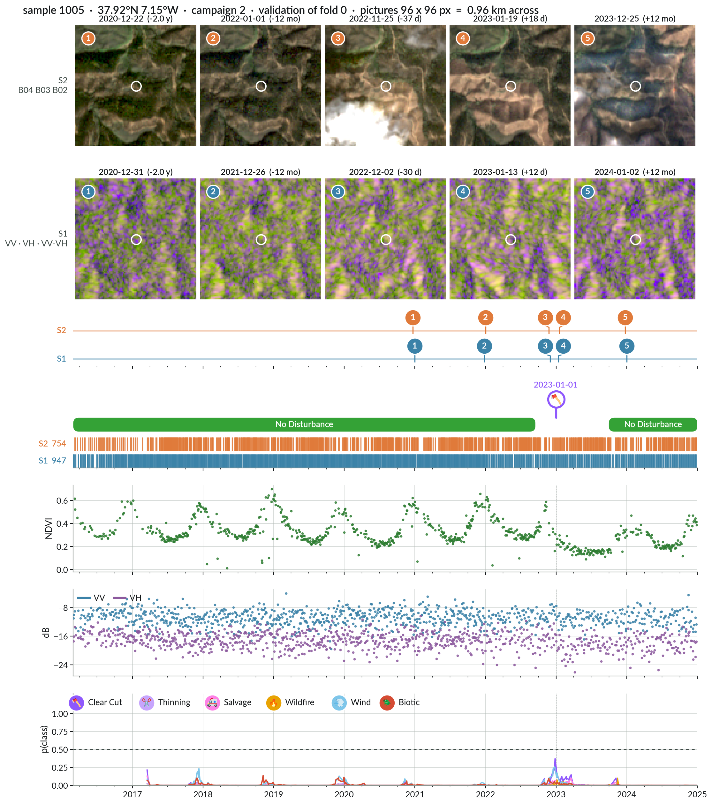

# 🎯 From data to predictions

[← The data](02_dataset.md) · [Docs home](README.md) · next: [Metrics →](04_metrics.md)



## One example

Any Sentinel-2 date inside a sample's annotated period becomes one training example —
1,017,043 of them in fold 0, plus 248,370 for validation. For a target date the loader
picks two short series of the labelled pixel:



| Series | Window | What it is for |
|---|---|---|
| recent | last 30 days | what the forest looks like now |
| yearly | one year earlier, ± 15 days | what it looked like in the same season |

A date is only used if both windows hold an image. Nothing after the target date is ever
loaded. Window sizes: `data.days_before`, `data.years_context`, `data.days_context`.
The batch layout is in the docstring of [`data/batch.py`](../forest_disturbance/data/batch.py).

## What the model must predict

One target: the **class** of the disturbance active on that date, or the most recent one
before it, else "No Disturbance". A second column, `days_since_event`, is not something the
model predicts — it is the age that decides how much the loss still believes that class.

Years after the storm the target is still "Salvage" — but nothing in the last 30 days could
tell you that. So the loss forgets old events:



The loss is a plain cross-entropy over the 7 classes. Its target fades with the age of
the event: up to ~215 days the true class is the answer; between 215 and 335 days the loss
takes the *smaller* of the two cross-entropies, so answering "No Disturbance" costs the same
as answering the true class — but any other class still costs more, so the date is never
unsupervised; after ~335 days only "No Disturbance" is right. Rare classes are drawn more
often during training (`data.sampling_alpha`).
Code: [`models/loss.py`](../forest_disturbance/models/loss.py).

## The baseline



`StatisticalMLP` ([`configs/statistical_mlp.yaml`](../configs/statistical_mlp.yaml)): about
17 k parameters, Sentinel-2 centre pixel only. Each window becomes a mean and a standard
deviation of its 15 values; an MLP compares the two.
[`configs/statistical_mlp_notemporal.yaml`](../configs/statistical_mlp_notemporal.yaml) adds
learned MLPs before and after the statistics (about 58 k parameters); only its `model:`
section differs. The name comes from the benchmark code.

It does not know which image in a window is the newest, nor when in the year it is: all it
sees is two summaries. That is the weakest link — start there.



The bottom panel is what your model writes to
`runs/<run>/predictions/epoch_XXX.parquet`: one probability per class, on every date.

## What a run produces

```
runs/statistical_mlp_20260921-1015/
├── config.yaml                          exactly what you ran
├── predictions/epoch_000.parquet        one row per validation date: labels + class probabilities
├── predictions/epoch_000_metrics.json   all metrics of that epoch
└── checkpoints/last.ckpt
```

The same metrics go to Weights & Biases (or `metrics.csv` with `logger.kind=csv`).

## Swap in your own model

1. Write an `nn.Module` whose `forward(batch)` returns the class scores (logits) `[B, 7]`,
   in `forest_disturbance/models/`.
2. Add it to `MODELS` in `forest_disturbance/build.py`.
3. Copy `configs/statistical_mlp.yaml`, set `model.name` and your own keys, run it.

Everything else stays the same, so your numbers stay comparable.

[← The data](02_dataset.md) · [Docs home](README.md) · next: [Metrics →](04_metrics.md)
