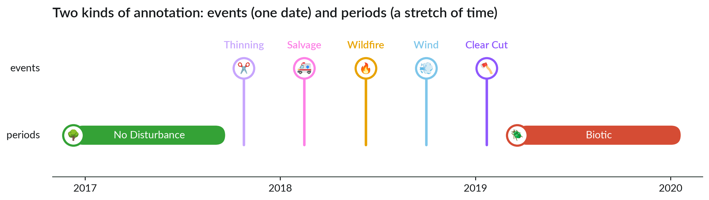
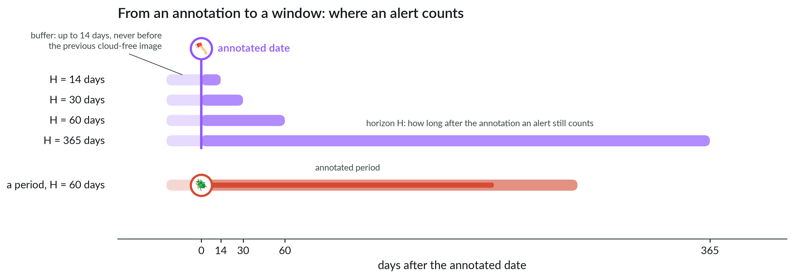
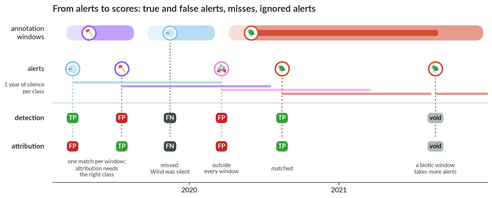

# 📊 Metrics

[← The data](02_dataset.md) · [Docs home](README.md) · next: [The model →](04_model.md)

The metrics ask one question: would you trust this model if it ran for real? Such a model
reads every new satellite image and, from the images so far, says whether something
happened, and what. A useful system does not raise alarms everywhere, all the time. So once
it sends an alert of a class, that class stays silent at this location for 365 days: one
shot per class, then a year of cooldown.

Two tasks:

- **detection** — find the disturbance, fast — scored with **binary F1**;
- **attribution** — find it *and* name its cause, fast — scored with **macro F1**.

Both compare the model's alerts with the annotations. Three steps get us there.

> **📌 The metrics are fixed.** Everyone scores with the same windows, horizons and matching
> rules, so that your numbers compare with the baseline, with each other and with other
> methods. Do not change them to improve a score. If you have a good reason to question a
> rule, bring it to the teachers first and we will discuss it.

## 1. Events and periods

Annotations come in two kinds. An **event** is one date: most disturbances (clear cut,
thinning, salvage, wildfire, wind) are annotated on the date the change first shows. A
**period** is a stretch of time: healthy forest and regrowth (both "No Disturbance"), and
Biotic — a bark beetle outbreak often lasts more than a year.

## 2. From annotations to windows

How long after a disturbance does an alert still count? A week, a month, a year? There is no
single right answer. So each annotation becomes a **window**, and we score at four
**horizons** H: 14, 30, 60 and 365 days after the annotated date. The shorter H, the faster
an alert must come.

Annotated dates are approximate: the annotator marks the first cloud-free Sentinel-2 image
on which the change is clear, so the real event can be earlier — weeks earlier in a cloudy
season. The window therefore also starts a little before the annotation: up to 14 days, but
never before the previous cloud-free image, which still showed intact forest.

A Biotic period gets the same treatment: the buffer before its start, the horizon after its
end.

## 3. From alerts to scores

Alerts are taken in date order, and each one is compared with the windows of its sample:

- **True positive (TP)**: the alert falls in a window that has no alert yet. For
  attribution, the window must also be of the alert's class.
- **One match per window.** A second alert in a window already matched is a false positive
  — except in a Biotic window, which takes extra alerts without counting them (*void*).
- **False positive (FP)**: an alert that matches no window.
- **False negative (FN)**: a window that got no alert — including a disturbance that comes
  while its class is still silent after an earlier alert.
- An alert in the buffer before an annotation counts: early is fine.
- For detection, several classes alerting on the same date count as one alert.
- A sample is scored from one year after its first image (the model needs a history) until
  its first ignored label (e.g. drought).

In the example, the early Wind alert is a TP for detection — it lands on the clear cut — but
a FP for attribution; the later Clear Cut alert is the opposite.

Then, for each horizon:

| | |
|---|---|
| precision | TP / (TP + FP): the share of alerts that were right |
| recall | TP / (TP + FN): the share of disturbances found |
| F1 | 2 · precision · recall / (precision + recall) |
| **binary F1** | detection: classes ignored when matching |
| **macro F1** | attribution: the F1 of each of the 6 classes, averaged |

## 📌 The numbers to report, and to beat

`operational/binary_f1_{H}d` and `operational/macro_f1_{H}d`, for H = 14, 30, 60, 365. The
baseline ([next page](04_model.md)) on fold 0:

| horizon | binary F1 (detection) | macro F1 (attribution) |
|---|---|---|
| 14 days | 0.12 | 0.10 |
| 30 days | 0.19 | 0.15 |
| 60 days | 0.34 | 0.28 |
| 365 days | 0.60 | 0.48 |

Precision and recall are logged too (`…_precision_{H}d`, `…_recall_{H}d`): look at them to
see *why* an F1 moves. Every metric is computed after each validation epoch, and
`python scripts/evaluate.py <predictions.parquet>` recomputes them from a saved file.

Four rules: compare models on the same fold and the same settings; fold 0 for exploring,
five pooled folds for a result; a fold holds few events per class (21 wildfire annotations
in fold 0, from 4 fires), so small gaps are noise; annotated dates are approximate
([the data](02_dataset.md)), so never quote a delay as real-world latency.

[← The data](02_dataset.md) · [Docs home](README.md) · next: [The model →](04_model.md)
