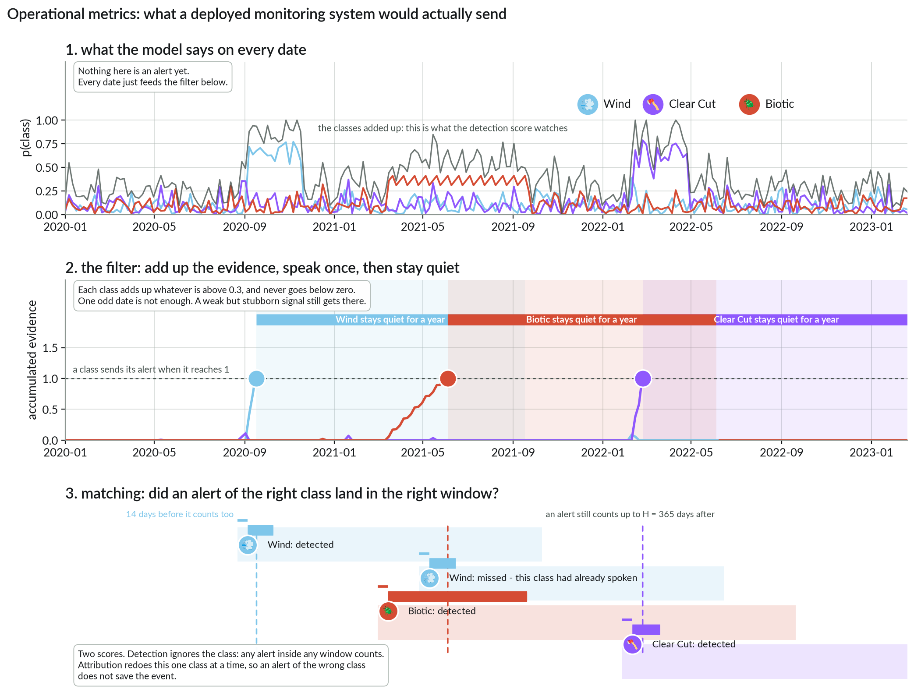
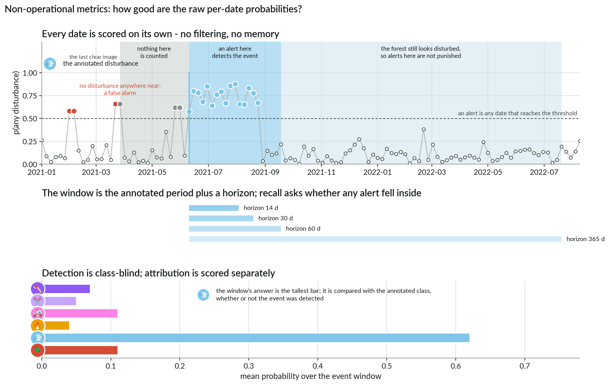

# 📊 Metrics

[← Data to predictions](03_baseline_model.md) · [Docs home](README.md) · next: [The code →](05_codebase.md)

Your model gives one prediction per date. Users care about **events**: was this storm
found, in time, and was it called "Wind"? The scores that answer this are the
**operational** ones: they score the alerts a monitoring system would actually send.

Two words used throughout: an **event** is one annotated disturbance; an **alert** is a
date on which the model says "disturbance".

All metrics run after every validation epoch, and
`python scripts/evaluate.py <predictions.parquet>` recomputes them from a saved file.
Anything logged under `val/` is only there to check that training works.

## Operational: the scores that count

A real system decides once, and every alert costs a field visit. So probabilities go
through a filter, per sample and per class:

```text
score = max(0, score + probability − alpha)      on every image date
alert when score ≥ threshold, then score = 0
after an alert: silence for rest_period_days (365)
```



One confident date, or several so-so dates in a row, fire an alert; an isolated spike does
not. The per-class `alpha` and `threshold` in `evaluation.operational` are fixed: everyone
reports with them. Tune your own if you like, but always show the fixed-value numbers too.

Matching, which is where the rules bite:

- An alert matches an event of its sample if it falls in **[start − B, end_evidence + H]**,
  for a horizon H of 14, 30, 60 or 365 days (`evaluation.horizons_days`): the shorter H, the
  faster the alert must be.
  B is at most 14 days and never reaches past the previous clear image — an alert slightly
  *early* is fine, because the annotation date is only the first clear view of the change.
  (The non-operational grey zone below is unbounded, so the two families can disagree.)
- **One alert per event.** Alerts are matched in date order to the first event not yet
  detected; a second alert on a detected event is a false positive, except for slow biotic
  events. An event with no alert is a miss — including events that fall in the 365-day
  silence after another alert.
- **Delay** = alert date − event start, and can be as low as −14 days.
- **A class that has spoken is silent for a year**, so a second disturbance of the same
  class inside that year is a miss whatever the model does. A different class can still
  fire during it.
- Class metrics repeat the matching per class: a "Wind" alert on a clear cut is a false
  positive for Wind *and* a miss for Clear Cut.
- Scoring of a sample starts one year after its first image and stops at its first ignored
  label.

The scores, for each horizon H:

| Key | Meaning |
|---|---|
| `operational/binary_precision_{H}d` | alerts that hit a disturbance, whatever its class |
| `operational/binary_recall_{H}d` | disturbances that got an alert in time |
| `operational/binary_f1_{H}d` | both in one number |
| `operational/macro_{precision,recall,f1}_{H}d` | the same, class by class, averaged over the 6 classes: is the *type* right? |

## Non-operational: is the signal there?

A diagnostic, not a score to report.

A date is an alert when the summed probability of the six disturbance classes reaches
`evaluation.threshold` (0.5). No filtering over time.



For each event and a horizon H (14, 30, 60, 365 days), the window runs from the event start
to `end_evidence + H`, stopping before the next event. Some dates count neither way: those
between the previous clear image and the event, those inside an ignored label, and those in
the year after the window, while the forest still looks disturbed.

| Key | Meaning |
|---|---|
| `binary_recall_{H}d` | events with at least one alert in their window |
| `alert_precision_{H}d` | alerts inside a window, over all alerts that are not ignored |
| `PR_AUC_{H}d` | precision-recall area when the 0.5 threshold is swept — threshold-free |
| `window_agent_f1_macro_{H}d` | average the class probabilities over the window: is the *type* right? |
| `detection_rate_1y`, `average_detection_delay_days_1y` | found within a year, and how late |

These describe the *potential* of a model: one that flickers on and off every week still
scores well here.

## 📌 Which number to report

The operational precision, recall and F1, binary and macro, at each horizon:
`operational/{binary,macro}_{precision,recall,f1}_{14,30,60,365}d`.

Four rules: compare models on the same fold and the same settings; fold 0 for exploring,
five pooled folds for a result; a fold holds few events per class (21 wildfire annotations
in fold 0, from 4 fires), so small gaps are noise; delays are measured against the annotated
date, which is itself only approximate ([the data](02_dataset.md)) — never quote one as
real-world latency.

[← Data to predictions](03_baseline_model.md) · [Docs home](README.md) · next: [The code →](05_codebase.md)
